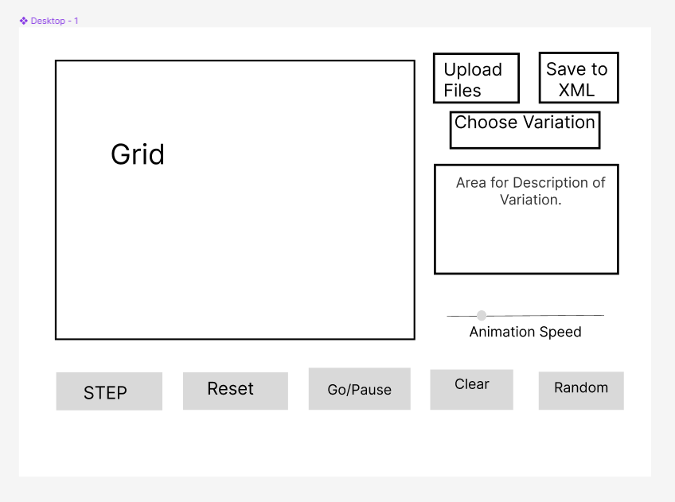

# Cell Society Design Plan
### Team 4
### Brandon Weiss, Han Zhang, Changmin Shin

#### Examples

Here is a graphical look at my design:

made from [a tool that generates UML from existing code](http://staruml.io/).

Here is our amazing UI:

taken from [Brilliant Examples of Sketched UI Wireframes and Mock-Ups](https://onextrapixel.com/40-brilliant-examples-of-sketched-ui-wireframes-and-mock-ups/).

## Overview

The goal of the project is to create a program that can implement as many variations of Cellular Automata as possible, 
and the primary goal is to make it easy to add new kind of rules or variations of Cellular Automata, which is supported
by the Rules, and Cell abstractions. For the primary architecture of the design _____

The program will be based upon a model-view separation. The view will handle construction of the GUI, and 
the model will handle the inputs fed to the view behind the scene, such as the state of cells.

## User Interface

.

For Grid, the user will be able to click on individual cells to change the state of the cells.
If the user loads up an empty file or a bad XML file, inside the 
area for Description of Variation it will create a pop-up that will read either "empty file " or "bad XML file". 

If the user saves the current state of the simulation as an XML configuration file, then a pop-up
will appear asking for tags that are missing, which don't come from the program(ex, Author, Name of Configuration, ect). 
If an invalid field is entered for any tag, a pop-up will appear stating the issue. 
After the error pops up, the grid will not run until the grid is cleared. 

While the exact specifics of the error box isn't defined yet, the general appearance will match
the view given in the image above. The discussion we have in our group is whether to display every field
as an input or to have the error message only display fields that are invalid.  

## Configuration File Format

XML file tags

- sim_type 
- config_Name
- author
- description
- width
- init_state
- heightgit
- params

The two example files are listed in the data folder, called Example1.xml and Example2.xml. 

We decided to use mainly XML elements in both data folders, as we didn't see a scenario where a xml attribute would
be preferred over an XML element, due to attributes not being easily mutable, and there wasn't a need
for meta-data, so everything is an element. 

## Design Overview
We plan to use abstraction for Cell and Mode.
Cell class will be a base for cells in different states, such as dead, alive, in transition, etc. Each individual Cell will form the Grid, which is the 2D array used to display the simulation.
Mode will be a base for different modes of simulation that determines how it is executed. Each variation of Mode will have rules of how each cell will interact with its neighbors.

Here is the Design Chart for our Design Overview. The arrows with white blanks stand for inheritance,
the dotted arrows are dependencies, and the arrows with white diamonds mean composition, which means the 
class makes up part of another class. With our Model/View approach, we have two main connects between the two
categories, between Mode and GUI Container, as well as PopUp and Config. 

## Design Details
Cell abstraction will be implemented depending on the state of the cell, and will contain information about the size of the cell(width and height), coordinates, which is its location on the grid, and the color of the cell depending on its state.
Mode abstraction will be implemented depending on the variation of the simulation the user is willing to choose. Each implementation of Mode will contain a “rulebook” of the behavior of the cells depending on the state of its own state as well as their neighbors’. Thus, each cell’s state(and color) will be altered by the rules in the Mode. Also, the description about the simulation displayed on the right side of the simulation screen will be altered to match the variation the user chooses from the drop menu.

We also have a possible class named Engine which holds information about the simulation itself as well as methods that operate the simulation. However, we are still undecided on whether this class should be separate from the Mode, and is left as a design conflict which will be discussed in the section below.

Some possible roles Engine(whether it’s integrated with Mode or not) include the initial simulation speed and updating the speed, setting the Grid to its initial state depending on the configuration file, and applying changes to each cell’s state and color using the “rules” or algorithms from Mode. Setting the Grid to its initial state will also be affected by the Config class which reads and interprets the XML file reader uploads.

The way we make sure our method signatures don’t reveal the difference between implementations of data structure, file format, and OpenJFX “grid” component is by ensuring that encapsulation is shown in each class that deals with these implementations. Since the Mode is implementing the data structure, it returns whatever implementation it needs, and we keep the exact implementation private by keeping the instance variable of whatever the data structure is private. The same goes for the XML file, no matter what format the XML file is read in, the XML will return a string to the Mode class, meaning that we only need to change the config class. The OpenJFX grid component is going to be contained within the Grid class, and it doesn’t matter how it’s implemented, as the GUIContainer class will display it regardless. While the exact data type that is passed by each one of these classes is still up for debate within the group, the idea is that whatever we return will be private and handled by the class that instantiates the object.
## Use Cases

 - Apply the rules to a middle cell: set the next state of a cell to dead by counting its number of neighbors using the Game of Life rules for a cell in the middle (i.e., with all its neighbors)

   - int alive = Cell.countAliveNeighbors();

   - Mode.setCellStatus(cell, alive);

 - Apply the rules to an edge cell: set the next state of a cell to live by counting its number of neighbors using the Game of Life rules for a cell on the edge (i.e., with some of its neighbors missing)

   - if(Cell.isEdge()) {

   - int alive = Cell.countAliveNeighborsEdge();

   - Mode.setCellStatus(cell, alive);

   - }

 - Move to the next generation: update all cells in a simulation from their current state to their next state and display the result graphically

   - Mode.nextGen();

   - Grid.updateGrid();

 - Switch simulations: load a new simulation from a data file, replacing the currently running simulation with the newly loaded one

   - Config.readFile();

   - Mode = new Mode(Config.getVariant());

   - Mode.clear();

   - Mode.setUp();

   - Mode.run();

 - Set a simulation parameter: set the value of a parameter, probCatch, for a simulation, Fire, based on the value given in a data file

   - int probCatch = mode.setParam(some constant);

 - On Grid click, change the state of the Cell

   - if(Cell.isClicked){

   - Mode.setCell(state, cell.getX(), Cell.getY());

   - }

 - Increase/Decrease Animation Speed

   - Mode.setSpeed(Animation.getValue());

 - Save an XML File from the simulation configuration

   - file = GUIContainer.saveConfig();

 - Display a popup with an error message
   - Popup.show(errorMessage);
 
   - Reset cell/grid state to initial state
 
   - Mode.clear()
 
   - Mode.setUp()

 - Generate random cell/grid state

   - if(Random.isClicked) { 
   - Mode.setRandom()
   - }

## Team Responsibilities

 - Timeline:
   - By Friday, check on the basic classes/methods.
   - By Sunday, integrating and debugging code.
   - By Monday, have Game of Life up and running with GUI and abstractions.
   - By Monday after that, have more variants and more features for the GUI.
 - Brandon:
   - Primary responsibility: Mode and variations.
   - Secondary: Cell.
 - Han:
   - Primary: GUIContainer, Grid.
   - Secondary: Mode/Engine
 - Changmin:
   - Primary: Cell classes: basic constructor, methods for superclass, two subclasses(dead and alive cell), Config class: basic constructor, methods for reading and saving XML files
   - Secondary: GUIContainter, Grid.

